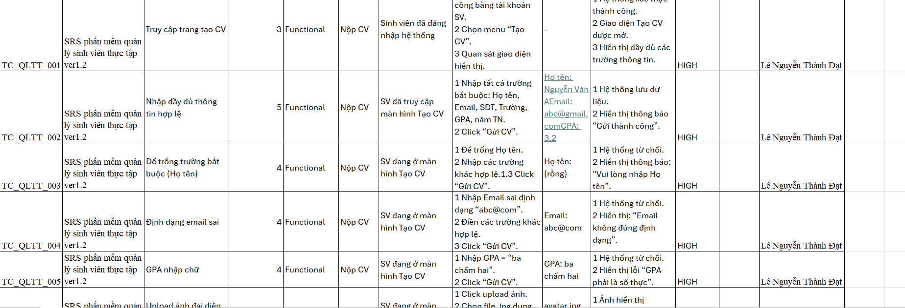

# PhanMem_QLSVThucTap_PSI
Viết TestCase, DefectList cho phần mềm quản lý sinh viên thực tập
# Internship Student Management System Testing

## 📌 Description
This repository contains testing artifacts for the Internship Management System.

## 🧪 Scope
- Understand requirements
- Test Case Design
- Defect List
- Test Report
  
## 📂 Documents
- Tìm Hiểu Yêu cầu: /LeNguyenThanhDat_Timhieu_PSI_ver1.0.docx
- Test Cases: /LeNguyenThanhDat_TCS_PSI_Ver1.0.xlsx
  
- Defect List: /LeNguyenThanhDat_DefectList_PSI.xlsx
- Test Report: /TestReport.docx
  
- ## 📊 Summary
- Total Test Cases: 200
- Passed: 148
- Failed: 4
- Blocked: 48
- Bugs Found: 30

## 🛠 Tools
- Excel
- Manual Testing
